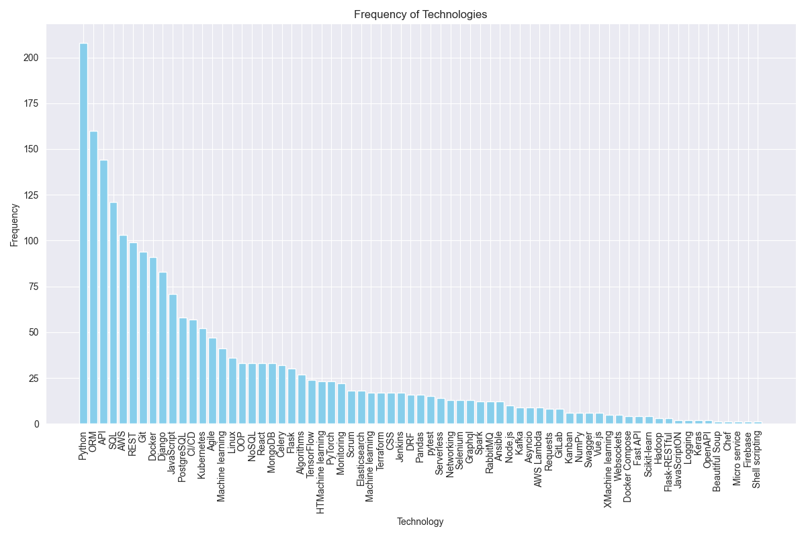
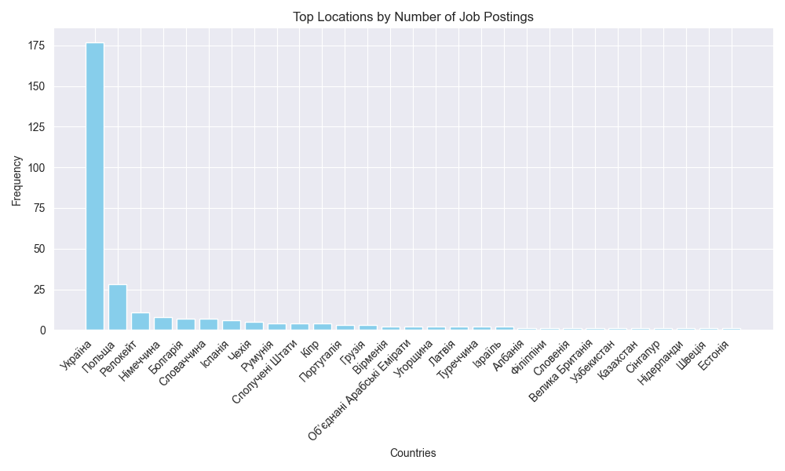

# Djinni vacancies scraping

## Overview
The Job Vacancy Analysis Project is a Python-based project, designed to aggregate and dissect job listings specifically tailored for developers sourced from Djinni.co. 

Leveraging the capabilities of the Scrapy framework, the project employs web scraping techniques to extract comprehensive information from the website's job listings. 
By meticulously examining multiple parameters such as available job positions, their respective views, and reviews, this project aims to offer an insightful analysis of the developers job market landscape. 

Through data extraction and analysis, it intends to provide valuable insights into various facets of the job market and trends in demand for developers related roles.

## Features

- **Scrapy-Powered Web Scraping:** Employs the Scrapy framework for web crawling and data extraction from job listings.

- **Statistical Data Interpretation:** Conducts comprehensive statistical analysis on acquired data, offering insights into available job openings, their visibility, and user feedback.

- **Expertise Analysis:** Provides a detailed breakdown of experience prerequisites for developer roles.

- **Geographical Analysis:** Delivers statistics and trends concerning the geographical distribution of job openings.

- **Technology Trends Identification:** Distinguishes prevalent technologies commonly cited in job listings.

- **Correlation Exploration:** Investigates relationships among user feedback, requisite experience, and specific technologies.

## Getting Started
1. **Clone the Repository**:

```bash
git clone https://github.com/Daniil-Pankieiev/jobs_scrapings.git
```
2. **Navigate to the Project Directory**:

```bash
cd jobs_scraping_analysis
```
3. **Create a Virtual Environment**:

```bash
python -m venv venv
```
4. **Activate the Virtual Environment**:
* On Linux/Mac:
```bash
source venv/bin/activate
```
* On Windows:
```bash
venv\Scripts\activate
```
5. **Install Dependencies**:

```bash
pip install -r requirements.txt
```
6. **Run the Web Scraping Script**:

```bash
scrapy crawl jobs -O job.csv
```
7. **Go to visualisation.ipynb**


8. **Click button "Run all" (Ctrl + Alt + Shift + Enter)**

## Sample Results


